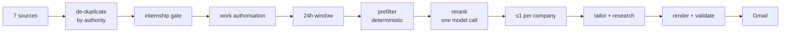

# Internship Digest

**A scheduled agent that finds the internships posted in the last 24 hours, ranks them against your actual experience, and writes a tailored resume and cover letter for each one — as PDFs that keep your formatting exactly.**

[](https://github.com/kurieu-mx/Internship_Agreggation_Platform/actions/workflows/tests.yml)
[](https://www.python.org/downloads/)
[](LICENSE)

Applying to internships is a search problem wearing a writing problem as a hat. The postings worth applying to are scattered across seven places, most of them are stale by the time you see them, and the ones that matter reward applying within a day. Then each one needs a resume that emphasises the right half of your experience and a cover letter that proves you read the posting.

This does all of it at 3pm, every day, for about **70 cents**.

```console
$ make digest
INFO collected 585 postings (greenhouse=25, lever=2, ashby=2, simplify=324, vansh=180, websearch=49, linkedin=3)
INFO dropped 6 posting(s) that are not internships
INFO eligibility: kept 427, dropped 40 as closed to sponsorship
INFO 26/427 postings inside the 24h window
INFO prefilter: 24 postings in target categories, taking top 15
INFO rerank: scored 15 postings, top score 86
INFO shortlist: 10 postings across 10 companies (cap 1/company)
INFO research: 4 verified fact(s) about Quantbot Technologies
INFO rendered Resume_Quantbot_Technologies_Machine_Learning_Research_Engineer.pdf (1 page)
INFO sent 10 posting(s) with 20 attachments
INFO this run cost $0.75
```

---

## The three problems worth solving

### 1. A generated resume must not invent experience

This is the one that matters. A model asked to "tailor a resume" will happily add a technology you have never used, and you will not notice until an interviewer asks about it.

So the model never writes a resume. It **selects from a pool**. `profile.yml` holds every bullet you have ever written, each with an id; tailoring returns ids plus lightly reworded text; and four checks run before any PDF is accepted:

| Guardrail | Catches |
|---|---|
| **Provenance** | A bullet whose id isn't in the pool |
| **Text fidelity** | A bullet citing a *real* id while describing unrelated work |
| **Immutable facts** | Name, contact, employers, dates, school altered or dropped |
| **Page count** | A tailored resume that spills to page two |

Any failure rejects the PDF and falls back to your untailored master. The email says so, so you never discover it later.

The second check exists because the first is not enough: provenance alone is satisfied by citing `merlin-collision` and then writing "negotiated multi-million dollar vendor contracts". Text fidelity compares the rendered wording to its source and rejects substitution while still allowing the rewording that is the entire point.

### 2. Format preservation means regenerating, not editing

The pipeline never edits a PDF. It regenerates one from structured content through the same renderer every time, which is what makes every variant come out with identical layout. Editing PDF text in place cannot do this — a replacement string of a different width reflows the line, and from there the page.

If only a PDF of your resume exists, the layout is rebuilt in HTML/CSS from measurements taken off the original with PyMuPDF — margins, leading, the exact faux-small-caps trick, the metric-compatible font. `make verify-render` then renders the master's own content and diffs it against the original:

```console
$ make verify-render
  master:  1 page(s), 501 words
  rebuilt: 1 page(s), 503 words
  text similarity: 99.4%

  The rebuild reproduces the master.
```

That runs on every template change, so drift is caught when it appears rather than when an application goes out.

### 3. A cover letter is only worth sending if it could not have been sent to anyone else

Which means naming something specific and true about the employer — exactly what a model will invent when it has nothing to go on.

So it never asks a model what a company does. It fetches the company's own pages, extracts claims **with quoted evidence**, and validates every quote back against the source text. Claims that cannot be traced are dropped, not softened. If nothing survives, the letter is written about the role instead of with a fabricated hook.

The letterhead uses the company's real logo and a colour extracted from its own pixels — the most *saturated* colour, not the most common, because logos are mostly background.

---

## How it works



| Module | Responsibility |
|---|---|
| `sources/` | Seven adapters behind one protocol — Greenhouse, Lever, Ashby, two community feeds, web search, LinkedIn |
| `eligibility.py` | Internship gate, and work-authorisation filtering |
| `freshness.py` | The 24-hour window, and what to do about sources that publish no date |
| `store.py` | SQLite: seen postings, sent digests, per-run cost |
| `tailor/score.py` | Deterministic prefilter, then one model call to rank |
| `tailor/render.py` | The renderer and its four guardrails |
| `tailor/cover.py` | Grounded research and the sectioned letter |
| `tailor/branding.py` | Logo and brand-colour extraction |
| `budget.py` | Hard daily spend ceiling |

---

## Design decisions

**Every source fails independently.** A source that times out, changes schema, or loses its credentials costs you that source's postings for one run — not the run. The community feeds are public and always work; the search and logged-in legs are neither, and they *will* break. Isolating them keeps the reliable legs running when the unreliable ones fall over.

**ATS boards outrank aggregators.** A posting reaches Greenhouse the moment a recruiter publishes it, and reaches an aggregator when a contributor opens a PR. For a digest whose premise is "posted in the last 24 hours", that gap is the product. When the same posting arrives from both, the board's copy wins the merge and the aggregator backfills any field it left empty.

**Freshness is asked differently of different sources.** Dated sources get an exact comparison. Undated ones (search results) qualify only on first sighting — otherwise a dateless source re-qualifies its entire catalogue every day and the digest cries wolf until it gets ignored.

**Nothing is recorded as sent until it is sent.** A crash, an expired token, or a failed render means tomorrow's run picks the same postings up again. A failed send writes a Gmail draft and still reports failure, so the work survives without the postings being marked delivered.

**One application per company per day.** A second application to the same employer adds little; a first application to a different one adds a lot. Without the cap, a company that posts five roles takes half the slots — observed live, where one company took four of eight. When too few companies post, the digest is **short rather than padded**.

**Silence is not a rejection.** No source reliably publishes a sponsorship field — measured, 100% report `Unknown` — so work-authorisation status is derived from posting text instead, and only some sources publish any. Postings that stay unknown are *kept*; treating silence as a no would discard most of the corpus. The log reports the size of that blind spot on every run.

**Spend is capped in the database, not in memory.** A normal run is ~$0.72. The ceiling exists for the abnormal ones — a retry loop, a config typo, a workflow firing repeatedly. Once reached, model calls are refused and the pipeline degrades exactly as it does when the model is unreachable, so the digest still goes out. A cap held in memory does not cap a crash-loop.

**Measured, not estimated.** `make costs` counts real tokens against your real profile via `count_tokens`, which is free. `make verify-render` diffs the rebuilt resume against the original. `make boards` checks every configured job board still resolves. Guessing at any of these was wrong by 20–100% when checked.

---

## Quickstart

```bash
git clone https://github.com/kurieu-mx/Internship_Agreggation_Platform.git
cd Internship_scrapper
make install
make preview          # today's postings — no credentials needed
```

Then, for the full digest:

```bash
cp .env.example .env  # add an Anthropic key and a Composio key
cp ~/your-resume.pdf profile/master.pdf
make doctor           # reports what is still missing, and the fix for each
make digest-dry       # builds everything, sends nothing
```

`make doctor` is the load-bearing one. Setup touches four systems that each fail quietly and identically — an unset key looks exactly like a key with no Gmail connected — so it reports the actual state of the machine and the exact command that fixes each gap.

```console
$ make doctor
  [ ok ] Anthropic API key  set (sk-ant-api0...), SDK installed
  [ ok ] master resume      master.pdf (WeasyPrint, rebuilt from measurements)
  [ ok ] render toolchain   weasyprint + Nimbus Roman (metric-identical to Times)
  [ ok ] render fidelity    rebuild matches the master at 1 page(s)
  [ ok ] spend cap          $0.00 of $2.00 used today
  [ ok ] Handshake          off by choice (not in SOURCES)

  Everything is configured.
```

### Commands

| | |
|---|---|
| `make preview` | Today's postings, no credentials required |
| `make doctor` | What is configured, what is missing, how to fix it |
| `make costs` | Measure a day's API cost against your real profile |
| `make verify-render` | Prove the renderer still reproduces your master resume |
| `make boards` | Check every configured job board still resolves |
| `make digest-dry` | Build the full digest, send nothing |
| `make digest` | Build and send |
| `make test` | 442 tests |

`python main.py --cover-preview <company>` iterates on one cover letter without a full run; add `--no-research` to make it free.

---

## Running it on a schedule

`.github/workflows/daily-digest.yml` fires at 3pm local, every day.

GitHub's scheduler is UTC-only, so hitting 3pm year-round takes two cron entries and a guard — one for daylight time, one for standard, with a step that exits the run that is an hour off. A single UTC cron drifts by an hour twice a year.

Requires six repository secrets: `ANTHROPIC_API_KEY`, `COMPOSIO_API_KEY`, `COMPOSIO_USER_ID`, `DIGEST_TO`, and `PROFILE_YML` / `MASTER_PDF_B64` — your resume is git-ignored, so it reaches CI as a secret rather than living in a public repo.

---

## Cost

Measured with `count_tokens` against a real profile and a real posting, at ten companies a day:

| Setup | Per day | Per month |
|---|---|---|
| **Opus for writing, Haiku for research** | **$0.72** | **~$22** |
| All Opus | $0.92 | ~$28 |
| All Sonnet | $0.55 | ~$17 |

Split by what each call does rather than to shave the bill: scoring decides which companies you apply to, and the resume and letter are documents a human judges you on — neither is the place to save two cents. Company research is extraction whose output is validated against its source, so a cheaper model cannot smuggle anything through.

Prompt caching carries about three-quarters of input volume at a tenth of the price; without it the same run is roughly $1.10.

Quiet days cost nothing — no fresh postings means no calls at all.

---

## Limitations

- **Work-authorisation filtering sees only part of the corpus.** Roughly a tenth of postings carry text to inspect. It catches postings that *say* they are closed to you, not all of the ones that are.
- **Web search and LinkedIn are the weakest legs.** Results are undated, unstructured, and rank below every other source. LinkedIn is reached through public web search — the site is never scraped — so coverage is whatever they choose to make publicly indexable.
- **Handshake needs a browser cookie that expires.** Off by default. It is the only source that sees school-restricted postings, and the least durable thing here.
- **One posting per company per day** is a deliberate trade, not a limitation, but it does mean a company posting several genuinely different roles is under-represented. The overflow appears in the digest as links.
- **Company research depends on a fetchable marketing site.** Small firms with thin web presence yield nothing, and their letters are written about the role instead.

## License

MIT — see [LICENSE](LICENSE).

Built by [Eugenio Kuri Muzquiz](https://github.com/kurieu-mx), studying Data Science at the University of Michigan.
