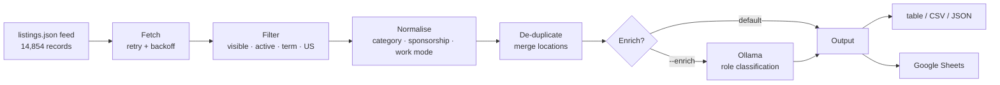

# Internship Scraper

**A data pipeline that turns 14,800+ community-sourced job postings into a clean, filtered dataset of US tech internships — with optional local-LLM classification and Google Sheets sync.**

[](https://github.com/kurieu-mx/internship-scraper/actions/workflows/tests.yml)
[](https://www.python.org/downloads/)
[](LICENSE)

Job boards are noisy: expired postings, foreign roles mixed with US ones, and categories so coarse that "AI/ML/Data" covers everything from ML research to spreadsheet work. This tool ingests the public [Pitt CSC / Simplify internship feed](https://github.com/SimplifyJobs/Summer2026-Internships), filters it down to *active, US-based postings for a given term*, normalises the messy fields, and emits a table, CSV, JSON, or a live Google Sheet.

From 14,854 raw listings it currently yields **513 active US Summer 2026 postings** in about two seconds.

---

## Demo

No API keys, no accounts, no config — clone and run:

```console
$ python main.py --limit 8
INFO fetched 14854 raw listings
INFO kept 513 jobs (skipped: hidden=6, closed=13367, term=890, non_us=78)

Company                   Position                                        Location                    Field                 Sponsorship
--------------------------------------------------------------------------------------------------------------------------------------------
Revise Robotics           Engineer Intern                                 NYC                         Hardware              Unknown
Spacial AI                Software Engineer Intern                        Palo Alto, CA               Software Engineering  Unknown
Varick Agents             Engineer Intern                                 SF                          Software Engineering  Unknown
Kinetic Systems           Applied AI Intern                               SF                          AI / ML / Data        Unknown
Denari                    Product & Software Internship                   Madison, WI                 Software Engineering  Unknown
Schweitzer Engineering …  Software Engineer Intern                        Boise, ID                   Software Engineering  Unknown
City of Charlotte         Management Analyst Intern - Research and Plan…  Charlotte, NC               AI / ML / Data        Unknown
Cybernetic Labs           Software Engineer Intern - Agent Platform       SF                          Software Engineering  Unknown

8 postings
  Software Engineering: 5
  AI / ML / Data: 2
  Hardware: 1
```

That seventh row is the case for the `--enrich` flag: a research-and-planning analyst role filed upstream under `AI/ML/Data`.

Other things it does:

```bash
python main.py --category quant --term ''        # every term, quant roles only
python main.py --format csv --out internships.csv
python main.py --format json | jq '.[].Company'
python main.py --enrich                          # refine roles with a local LLM
python main.py --sheets --schedule 09:00         # append to Sheets daily at 9am
```

---

## Quickstart

```bash
git clone https://github.com/kurieu-mx/internship-scraper.git
cd internship-scraper
python -m venv .venv && source .venv/bin/activate
pip install -r requirements.txt
python main.py --limit 20
```

Requires Python 3.9+. The Google Sheets and LLM features are opt-in — everything above works without them.

---

## How it works



| Module | Responsibility |
|---|---|
| `scrapers.py` | Fetch the feed with retry/backoff; filter and parse into `Job` records |
| `normalize.py` | Collapse messy upstream values into a small, predictable vocabulary |
| `models.py` | The `Job` dataclass — de-duplication key and row rendering |
| `enrichment.py` | Optional Ollama role classification, with output validation |
| `sheets.py` | Service-account Google Sheets writer with incremental appends |
| `main.py` | CLI, filtering, output formats, scheduling |

---

## Design decisions

**Read the structured feed, not the rendered page.** Version one of this project scraped three sites by parsing HTML and a markdown README. All three broke within months: Simplify retired its undocumented `/api/jobs` endpoint, Levels.fyi renamed the CSS classes the parser keyed on, and the Pitt CSC repo replaced its markdown tables with a rendered site. The rewrite reads the `listings.json` that the same community repo publishes — a documented artifact rather than an incidental detail of a presentation layer, and already structured, so no field has to be guessed out of prose. Fewer moving parts, and it stops silently returning zero results.

**Deterministic first, LLM only for the gaps.** The feed carries authoritative values for most fields, so running a model over all of them would be slow and would risk overwriting good data with a hallucination. Sponsorship, work mode, and location are derived in plain Python. The LLM is asked one narrow question — mapping a job title onto a finer role taxonomy, because the upstream `category` is coarse enough to file *"Management Analyst Intern — Research and Planning"* under `AI/ML/Data`.

**Validate every model response.** `Enricher._match_label` checks each reply against a fixed label set and falls back to the feed's own category on anything unrecognised, so a model that answers *"Category: Astronaut"* cannot corrupt the dataset.

**Degrade, don't crash.** If Ollama isn't running, the pipeline logs one warning and continues unenriched. A model failure on a single posting loses one field, not the run. This keeps the project runnable by someone who just wants to see it work.

**Conservative US filtering.** Locations arrive as `NYC`, `Carlsbad, Ca`, `Long Island, New York`, and `Toronto, ON, Canada`, so a substring check for `"US"` is not good enough — it would keep Canadian postings and drop half the American ones. `is_us_location` checks explicit country markers first, then state codes, state names, and known bare-city aliases, rejecting anything it cannot positively identify. It also has to know that `Indiana` is not `India`.

**Service accounts over OAuth.** The original code used an interactive OAuth flow that opens a browser for consent — which cannot work from cron, the one place a daily scraper actually runs. Sheets access now uses a service account.

---

## Testing

```bash
pip install -r requirements-dev.txt
pytest
```

```
71 passed in 0.19s
```

The suite runs offline against a checked-in fixture sampled from the real feed, chosen to exercise every filter branch — a Canadian posting, a UK posting, a closed posting, a wrong-term posting, and a multi-term posting. Network behaviour (retry, backoff, malformed payloads) is covered with a scripted fake session, and the LLM path is tested for hallucinated labels, unreachable servers, and mid-batch failures. CI runs it on Python 3.9, 3.11, and 3.12.

---

## Configuration

Copy `.env.example` to `.env` to override any default. Every setting also has a CLI flag where it makes sense.

| Variable | Default | Purpose |
|---|---|---|
| `TERM_FILTER` | `Summer 2026` | Term to keep; empty keeps all |
| `ACTIVE_ONLY` | `true` | Drop postings marked closed upstream |
| `OLLAMA_BASE_URL` | `http://localhost:11434` | Ollama endpoint |
| `OLLAMA_MODEL` | `llama3.2` | Model used for `--enrich` |
| `GOOGLE_CREDENTIALS_FILE` | `credentials.json` | Path to a service-account key |
| `SPREADSHEET_ID` | – | From the sheet's URL |

### Optional: LLM enrichment

```bash
ollama pull llama3.2
python main.py --enrich --limit 50
```

### Optional: Google Sheets

1. In [Google Cloud Console](https://console.cloud.google.com/), enable the Sheets API and create a **service account**.
2. Create a JSON key for it and save it outside version control (`.gitignore` already covers `credentials.json`).
3. Share your spreadsheet with the service account's `client_email`, giving it Editor access.
4. Set `SPREADSHEET_ID` and `GOOGLE_CREDENTIALS_FILE` in `.env`, then run `python main.py --sheets`.

Appends are incremental: existing rows are read first and only genuinely new company/title pairs are written.

---

## Limitations

- **One upstream source.** Coverage is bounded by what the Pitt CSC / Simplify community repo lists. Adding a second source means writing another scraper against the `ListingsFeedScraper` shape.
- **Sponsorship is usually unknown.** ~99% of postings carry `Other` upstream, and a job title genuinely does not reveal visa policy, so the pipeline reports `Unknown` rather than guessing.
- **Locations that are neither clearly US nor clearly foreign are dropped.** Precision over recall, deliberately, for a dataset that is explicitly US-only.

## Roadmap

- [ ] Fetch job descriptions from posting URLs to extract requirements and salary
- [ ] Second data source behind the same interface
- [ ] SQLite backend so history is queryable, not just appended
- [ ] Email/Discord digest of new postings matching a saved filter

---

## License

MIT — see [LICENSE](LICENSE).

Built by [Eugenio Kuri Muzquiz](https://github.com/kurieu-mx), studying Data Science at the University of Michigan.
